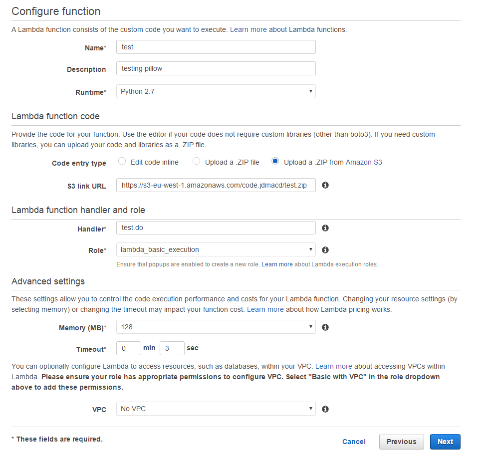

##Build

Report from `pip install --verbose --use-wheel pillow`

```

PIL SETUP SUMMARY
--------------------------------------------------------------------
version      Pillow 3.1.1
platform     linux2 2.7.10 (default, Dec  8 2015, 18:25:23)
             [GCC 4.8.3 20140911 (Red Hat 4.8.3-9)]
--------------------------------------------------------------------
*** TKINTER support not available
--- JPEG support available
*** OPENJPEG (JPEG2000) support not available
--- ZLIB (PNG/ZIP) support available
--- LIBTIFF support available
--- FREETYPE2 support available
--- LITTLECMS2 support available
--- WEBP support available
*** WEBPMUX support not available
--------------------------------------------------------------------

```

You can build your own by adding `build.sh` to Instance Details > Advanced Details > User Data field in the EC2 launch dashboard.

If you want the finished tar sent to a bucket after it is created, please uncomment this line:

```
aws s3 cp Pillow-3.1.1.tar.gz s3://<YOUR BUCKET>/Pillow-3.1.1.tar.gz --region <YOUR REGION>

```

Replacing `<YOUR BUCKET>` and `<YOUR REGION>` with the appropriate details. The EC2 instance will need the correct IAM role to perform this action.

##Test

The `build.sh` will also build a `test.zip` including `test.py` and `test.jpg` for unit testing on Lambda. Please uncomment this line:

```
aws s3 cp test.zip s3://<YOUR BUCKET>/test.zip --region <YOUR REGION>

```

Replacing `<YOUR BUCKET>` and `<YOUR REGION>` with the appropriate details. The EC2 instance will need the correct IAM role to perform this action.

Create a Lambda function using your prefered method. Dashboard example:

